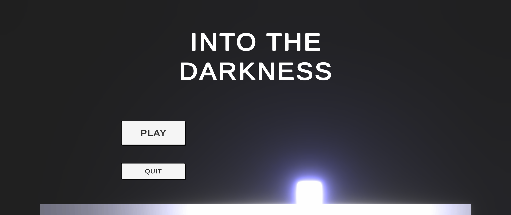
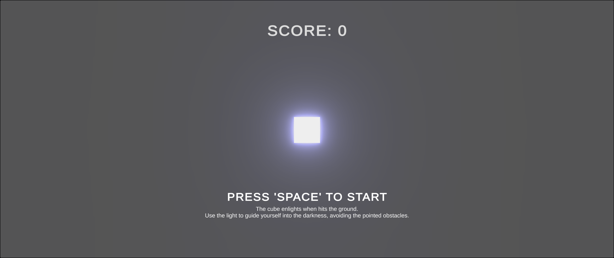
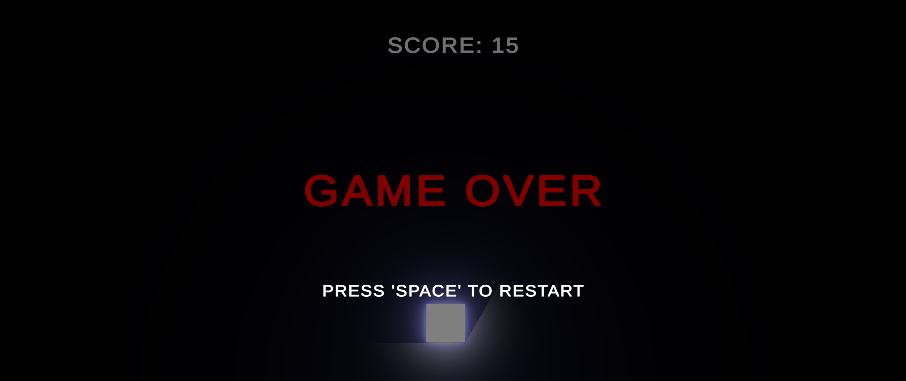

# Into The Darkness

A simple game developed with Unity and C#. This game was made for the first GameJam promoted by the channel FarmandoXP, with the theme of "light".

It is a platform game where you have to avoid obstacles into the darkness by enlightening yourself (a cube), and the environment, every time you hit the ground.

A Windows build is available on [itch.io](https://zille.itch.io/into-the-darkness).
